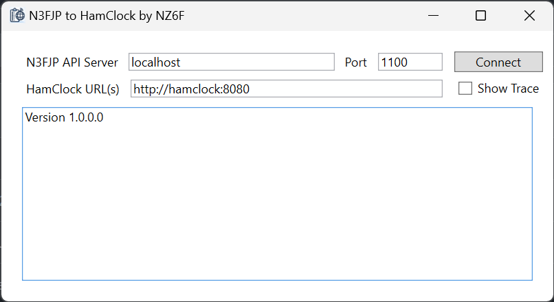

# N3FJP2HamClock

N3FJP2HamClock is a Windows application to synchronize HamClock with the call sign entry field in N3FJP logger applications. _This application has no affiliation with N3FJP nor HamClock._

This application connects to the N3FJP API server, and when you tab out of the call sign field, it will update your HamClock(s) with the DX of the entered call.

 

## Downloading

[Click here to download](https://github.com/ChrisRomp/n3fjp2hamclock/releases/latest/download/n3fjp2hamclock.setup.msi) the latest version.

You can also download the latest version or past versions from the [Releases](https://github.com/ChrisRomp/n3fjp2hamclock/releases) section.

## Installing

**Prerequisite:** This app requires the [.NET 8.0 desktop x86 runtime](https://dotnet.microsoft.com/en-us/download/dotnet/thank-you/runtime-desktop-8.0.0-windows-x86-installer?cid=getdotnetcore) to be installed to run. You can download that from Microsoft [here](https://dotnet.microsoft.com/en-us/download/dotnet/thank-you/runtime-desktop-8.0.0-windows-x86-installer?cid=getdotnetcore).

To install N3FJP2HamClock, run the downloaded [n3fjp2hamclock.setup.msi](https://github.com/ChrisRomp/n3fjp2hamclock/releases/latest/download/n3fjp2hamclock.setup.msi) file as you would any other application installer.

> [!NOTE]
> [Windows Defender SmartScreen](https://learn.microsoft.com/en-us/windows/security/operating-system-security/virus-and-threat-protection/microsoft-defender-smartscreen/) and/or your browser may give a warning or block the installation because this is not a commonly-downloaded application. This is expected behavior. If you don't trust the installer, you can also [compile your own build](#building-from-source) from the source code here.

## Configuring N3FJP

1. In your N3FJP application, e.g., AC Log, navigate to the Settings > Application Program Interface (API) menu.
1. If you need to change the TCP port, you can do so here. If you're unsure what this means, leave it at the default (1100).
1. Click the checkbox for TCP API Enabled (Server).
1. Click Done.

## Running N3FJP2HamClock

Launch N3FJP2HamClock from your Start menu, or from the application folder.

Fields:

- N3FJP API Server: This is the computer hostname running your N3FJP logging software.
- Port: The TCP port N3FJP is listening on.
- HamClock URL(s): Enter the web URL for one or more HamClocks to their REST API port (not the `live.html` port if you're using the web version). If you have more than one HamClock, you can enter them separated by commas, e.g.: `http://hamclock1:8080, http://hamclock2:8080`.
- Show Trace: You can leave this unchecked unless we need more information to troubleshoot an issue, or if you just like to see that sort of thing. Otherwise it's very chatty and will show the raw output from the N3FJP API server and some additional diagnostic information from this app.

Once you have entered the correct settings, click the Connect button. Your settings will be saved.

## Support

This application is provided with no guarantees it will work for anything. But if you're having problems, please open a [new issue](https://github.com/ChrisRomp/n3fjp2hamclock/issues) and I will try and provide some advice or a fix as my time allows.

## More Info

- [HamClock](https://www.clearskyinstitute.com/ham/HamClock/)
  - See HamClock FAQ #42 for a description of its API. This app is calling the `set_newdx` method.
- [N3FJP Software](https://www.n3fjp.com/)
  - [N3FJP API Documentation](https://www.n3fjp.com/help/api.html)

## Building from Source

If you wish to compile this application yourself, you are welcome to do so but detailed documentation is beyond the scope of this readme.

You will need to download the source code, install the [.NET 8.0 SDK](https://dotnet.microsoft.com/en-us/download/dotnet/8.0), and then you can build using `dotnet build --arch x86 --configuration Release src/n3fjp2hamclock/n3fjp2hamclock.wpf/n3fjp2hamclock.wpf.csproj`.

You should find the compiled application and DLLs located under the `src/n3fjp2hamclock/n3fjp2hamclock.wpf/bin/x86/Release/net8.0-windows` folder.

To build the MSI installer, you will need to use `MSBuild` instead of `dotnet build`, which is included with Visual Studio 2022 (you can download the [Community Edition](https://visualstudio.microsoft.com/vs/community/) for free). Once built, the MSI installer will be under the `src/n3fjp2hamclock/n3fjp2hamclock.setup/bin/x86/Release/en-US` folder. Or you can install the [WiX v4 toolset](https://wixtoolset.org/docs/intro/).

---

**73 de NZ6F**
